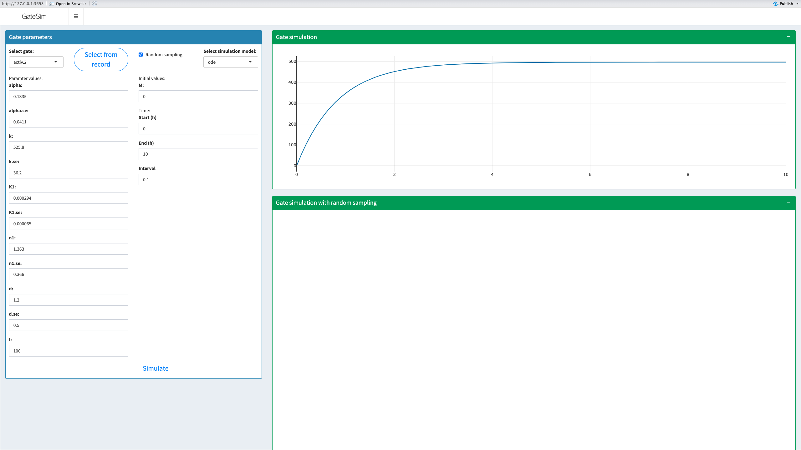
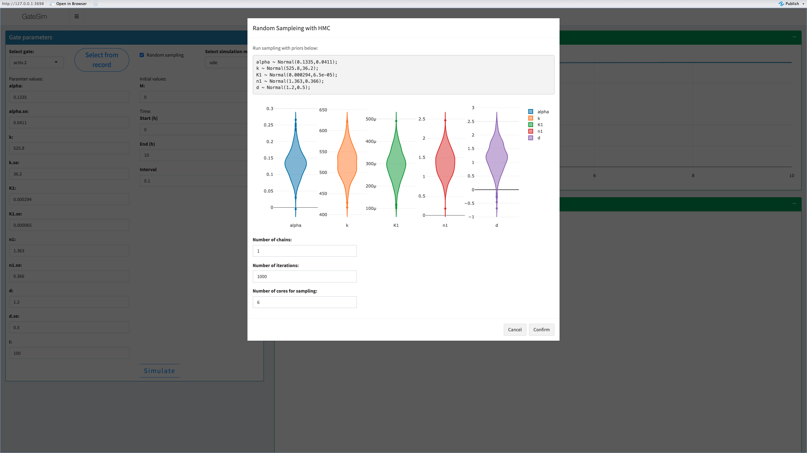
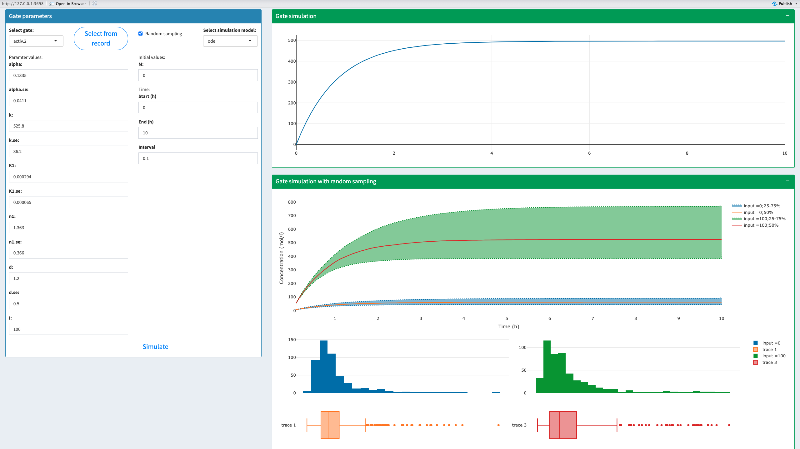

# GateSim: Stochastic simulations of the performance of genetic gates and other synthetic elements

## Introduction to GateSim

GateSim is a Shiny app with interactive interface to simulate logic genetic elements including AND gates, NOR gates, sensors and more to come. The app allows to predict the performance of those elements and its noise according to the kinetic equations of logic gates, initial concentration of substrates and the context of reactions (eg. enzyme catalytic efficiency). Simulations with ordinary differential equations (ODE) have been incorporated to GateSim with DeSolve package with built-in ODE models of genetic elements. GateSim can also perform ODE simulation with stochasticity generated by Hamiltonian Monte Carlo (HMC) sampling of parameters from genetic element characterization. Stochastic models were engaged with STAN scripts developed for GateSim.

As stochastic simulation with STAN mostly takes a few minutes to run and can easily cause time-out with remote connections, I am sorry that GateSim cannot be not hosted on the Shiny server, but please feel free to find the source codes of GateSim at <https://github.com/lynceuslq/GateSim> build it on your servers or PCs. Another aspect might be parameter inference of logic genetic elements, where you can visit <https://lynceuslq.shinyapps.io/shinyflour_new/> (online version of logic gate characterization app ShinyFlour) or <https://github.com/lynceuslq/ShinyFlourMCMC> (Bayesian MCMC version of ShinyFlour and its source code, which need to build on your own) and find your solution!

## Built-in ODE models of logic genetic elements

### Built-in simulation models for NOR gates and sensors

Simulation of NOR gates based on transcriptional control (eg. transcription factors) is based on mRNA production calculated with Hill equations and protein production predicted with ODE, as formula below. model $$y_{t} = y_{min} +(y_{max}-y{min}) \frac{k^n}{k^n+I^n}$$ $$\frac{dR}{dt} = y_{t}-d*R$$[^readme-1]

[^readme-1]: I for the concentration of input chemicals, R for the output protein production, $k$, $y_{min}$, $y_{max}$ and $n$ are parameters of gate response equations, $d$ is the parameter for protein degradation rate. Those symbols apply to the equations below.

Simulation of senors is similar to NOR gates, yet with Hill equation predicting sensor response, as formula below. model $$y_{t} = y_{min} +(y_{max}-y{min}) \frac{I^n}{k^n+I^n}$$ $$\frac{dR}{dt} = y_{t}-d*R$$

Stochastic simulation of NOR gates can engage the variation of gate parameter estimation, the noise of reactions and the distribution of observation, as formula described below.

Prior distribution of simulation parameters $$y_{min} \sim \mathit{N(y_{min,est}, y_{min,sd})}$$ $$y_{max} \sim \mathit{N( y_{max,est}, y_{max,sd})}$$ $$k_{n} \sim \mathit{N(k_{n,est}, k_{n,sd})}$$ $$n \sim \mathit{N(n_{est}, n_{sd})}$$ $$d \sim \mathit{N(d_{est}, d_{sd})}$$ $$\sigma_{R} \sim \mathit{ N(0,1)}$$

Posterior distribution of observation $$R_{obs} \sim \mathit{ N(R,\sigma_{R})} $$

### Built-in simulation model for intein-splicing AND gates

The simulation of those AND gates can be separated into two parts, which are the production of substrate proteins and the efficiency intein-splicing events. However, the latter reaches the steady state much sooner than protein production, therefore, in this model substrate protein production is described with ODE while intein-splicing events are calculated as the outcome of each time point. The model is demonstrated as equations below. The production of substrate proteins (M and N): $$\frac{dM}{dt} = k_{m} - d*(M-R)$$ $$\frac{dN}{dt} = k_{n} - d*(N-R)$$ Output protein (R) from intein-splicing events (calculation demonstrated in the next part): $$R = \frac{M+N+1/e - \sqrt{(M+N+1/e)^2-4MN}}{2}$$

Stochasticity in protein productions is described as posterior distributions: $$M_{obs} \sim \mathit{ N(M,\sigma_{M})}$$ $$N_{obs} \sim \mathit{ N(N,\sigma_{N})}$$ $$R_{obs} \sim \mathit{ N(R,\sigma_{R})} $$

Randomness due to parameter estimation is described as prior distributions: $$e \sim \mathit{N(e_{est}, e_{sd})}$$ $$k_{m} \sim \mathit{N( k_{m,est}, k_{m,sd})}$$ $$k_{n} \sim \mathit{N(k_{n,est}, k_{n,sd})}$$ $$d \sim \mathit{N(d_{est}, d_{sd})} $$ $$\sigma_{i} \sim \mathit{N(0, 1)} $$

#### The calculation of the concentration of output protein from intein-splicing events

The process of intein-splicing events can be described by the ODE below, yet the equation is not used directly in the model but the outcome concentration of response protein is engaged. 
Intein-splicing process described with ODE: $$\frac{dR}{dt} = s(m-R)(n-R)-de*R$$
At the steady state, where $\frac{dR}{dt}=0$，which is $$s(m-R)(n-R)-de*R = 0$$, which is $$R^2-(m+n+d/s)R+mn = 0$$
Roots for the equation are $$\frac{m+n+d/s - \sqrt{(m+n+d/s)^2-4mn}}{2}$$, and $$\frac{m+n+d/s + \sqrt{(m+n+d/s)^2-4mn}}{2}$$. Then we take the sensible root and let $e=s/d$, the concentration of output protein can be described as $$\frac{m+n+1/e - \sqrt{(m+n+1/e)^2-4mn}}{2}$$[^readme-2]

[^readme-2]: $m$ and $n$ stand for intein-fused molecules $R$ for spliced proteins, $s$ for synthetic rate and $de$ for protein degradation rate.

## GateSim examples with demonstrations

GateSim is designed for users with a minimum of knowledge in coding, ODE models and MCMC, yet, to run simulations with a graphic interface. I hereby use an example which simulates the performance of a sensor with HMC sampling to illustrate how to use GateSim.

#### 1. Select the type and mode of simulations

To start an analysis on GateSim, you need to choose the type of gate you want to simulate on the first step, here I use sensor as an example. You can then see the modes of simulations allowed to use on the gate, here I use the classic mode ODE but with stochastic effects by checking the box "Random sampling". The next step is type in the parameters of gate models, initial substrate concentrations and time settings, here, parameters can be selected from previous records by clicking the button "Select from record" and choosing the line on the table of records. Please note that parameters with ".se" extensions refer to the standard errors of corresponding parameters and can only display when you check "Random sampling" box. When all is done, you can click on the "Simulate" button on the bottom of Gate parameter box and process to the next part. 

#### 2. Checking random sampling setups (optional, only nesessary when simulate with random sampling)

The page that looks like the figure below will popup if you checked "Random sample" at the former step. This page allows you to checkout the distribution of parameters of selection and HMC sampling settings including the number of chains, the number of iterations and the number of CPU cores for sampling, it is recommended to use default settings for the test of sampling and you can increase the chain number and iterations later to optimize your simulations. As HMC sampling can take a few minutes to run, please make sure your settings are right before simulation. Simulations will start upon your clicking on the "Confirm" button and the window will close when simulation is done. 

#### 3. Navigate simulation outcomes

After a cup of tea, you may return to your laptop and check out the results of stochastic simulation. Gate simulation box displays the concentration of output substrates on the time track from ODE simulation without randomization. The box below with the heading "Gate simulation with random sampling" shows the results of stochastic simulation, which predicts output substrate concentration with boundaries that indicate the 75% confidential range as a result of HMC sampling. The curves representing 0 input substrate also display along side the curve of your input values as a contrast. You can click on the curves and see the histogram that show the posterior distribution of output concentration at the corresponding time point.

